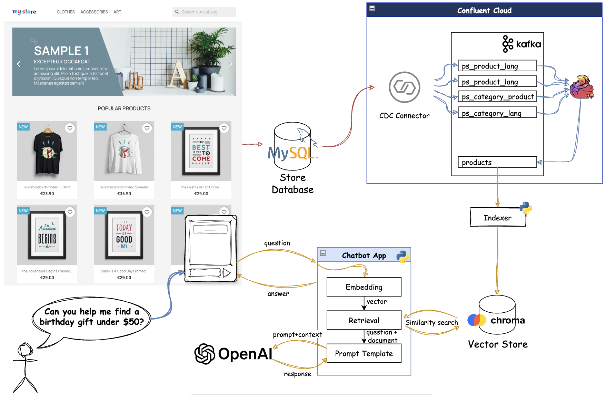
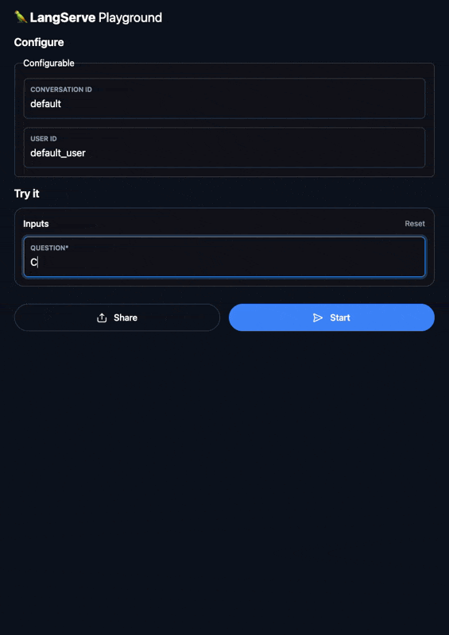
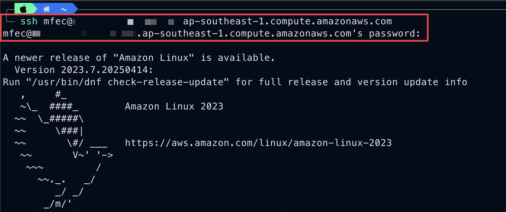
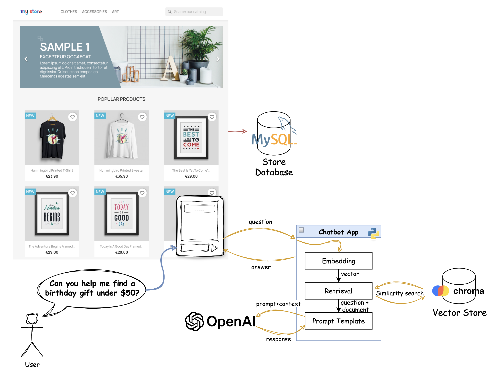
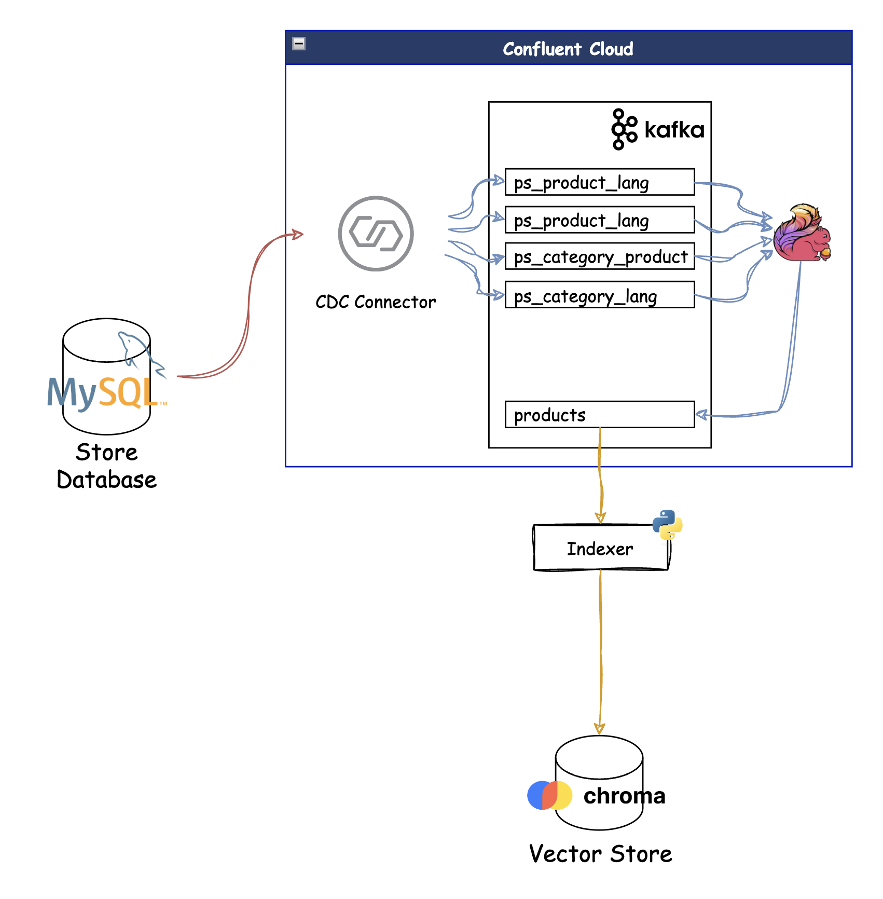
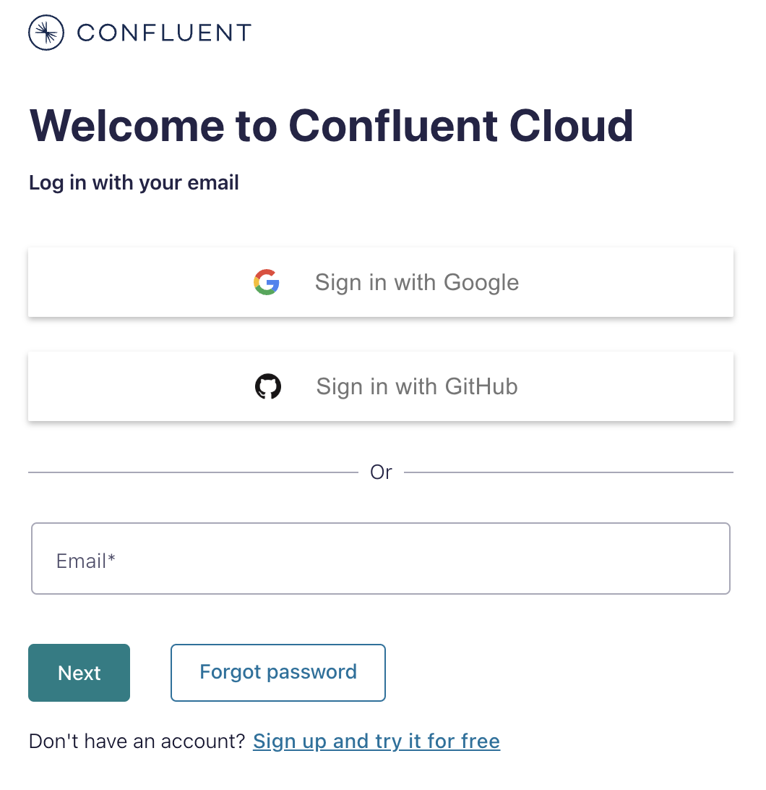
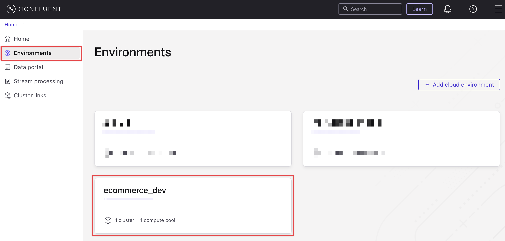
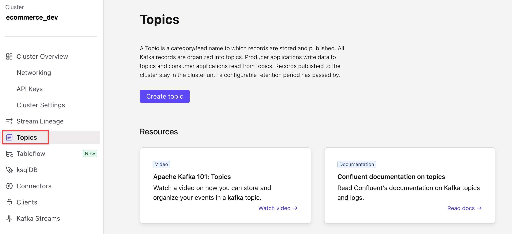

# <div align="center">Building Conversational AI with Real-Time Data Powered by Confluent</div>
## <div align="center">Lab Guide</div>
<br>

## **Agenda**
1. [Access environment](#step-1)
2. [Interacting with a bot that knows nothing](#step-2)
3. [Log into and Explore Confluent cloud](#step-3)
4. [Create connector to pull data from database](#step-4)

***

## **Prerequisites**
1. xx
2. xx

***

## **Objective**
Welcome to “Build an AI-Powered Shopping Assistant with Retrieval-Augmented Generation (RAG) and Real-Time Data Streams”!
In this workshop, you’ll learn how to create a smart, conversational shopping experience that understands what customers are looking for—whether it’s “running shoes under $100” or “eco-friendly kitchen products made in the US.”

We’ll walk through how modern eCommerce platforms can combine real-time data, search, and AI to build a virtual assistant that’s always up-to-date and ready to help.

By the end of this workshop, you’ll understand how to:
- Turn product data into searchable knowledge using vector databases and embeddings
- Keep the assistant’s knowledge fresh with real-time updates from your systems
- Use large language models (LLMs) to make product discovery more natural and intuitive

Whether you're working on product search, virtual shopping assistants, or personalized recommendations, this workshop will give you a hands-on introduction to what’s possible with Retrieval-Augmented Generation in retail.


<div align="center">
  
</div>

>💡 This workshop is based on the open-source project:
> [bleporini/rag-ecommerce](https://github.com/bleporini/rag-ecommerce)
***

## <a name="step-1"></a>Step 1 Access environment.
1. Open terminal (For MacOs using `terminal` and Window using `PowerShell`).
2. SSH to workshop environment, password will be invisible when input.
```ssh
ssh <user>@<url/ip>
```
<div align="center" padding=25px>
    
</div>

>💡 See document for user and url in each group, Example `ssh gp1@ec2.amazonaws.com`

3. Change current directory to `rag-ecommerce-master`.
```ssh
cd rag-ecommerce-master
```
<a name="file-url"></a>
4. Check your web url.
```ssh
cat xxxxxxxxxxxxx
```
>💡 This file contain url of Ecommerce web, Admin web, AI playground, VectorStore UI and Cloud API key/sercret.

***

## <a name="step-2"></a>Step 2 Interacting with a bot that knows nothing.
1. Access AI playground (url in [1.4](#file-url)) and play around AI without knowledge.
<div align="center" padding=25px>
    
</div>

>#### 🔍 Why doesn’t the AI have any knowledge? If we look at the current architecture diagram, we can see that the AI is unable to provide any information because no data has been ingested into the vector store yet.

2. So, before we begin, it's important to understand what we'll be doing in this workshop. We'll ingest data from a shop into Confluent Kafka using a CDC Connector, process it with Confluent Flink, and then store it in a vector store using an indexer implemented as a Python application.
<div align="center" padding=25px>
    
</div>

***

## <a name="step-3"></a>Step 3 Log into and Explore Confluent cloud.
1. Log into [Confluent Cloud](https://confluent.cloud) and enter email and password.
<div align="center" padding=25px>
    
</div>

<!--  -->
>💡 See email and password from document.
2. Explore Confluent Cloud enviroment (Please check your environment name from document).
<div align="center" padding=25px>
    
</div>
<br>

3. Explore Confluent Kafka Topic. 
>🔍 At the beginning, the Kafka topic will not yet exist. In the following section, we will set up a `connector` to pull the data in.
<div align="center" padding=25px>
    
</div>

***

## <a name="step-4"></a>Step 4 Create connector to pull data from database.

***