# <div align="center">Building Conversational AI with Real-Time Data Powered by Confluent</div>
## <div align="center">Workshop Guide</div>

## **Agenda**
1. [Access environment](#step-1)
2. [Interacting with a bot that knows nothing](#step-2)
3. [Log into and Explore Confluent cloud](#step-3)
4. [Create connector to pull data from database](#step-4)
5. [Create Flink statement to process the data](#step-5)
6. [Create Indexer to update knowledge from Confluent to Vector store](#step-6)

***

## **Prerequisites**
### Make sure to review the workshop docs: GitHub repo, Confluent Cloud account, and credentials needed for the hands-on session.

***

## **Objective**
Welcome to “Build an AI-Powered Shopping Assistant with Retrieval-Augmented Generation (RAG) and Real-Time Data Streams”!
In this workshop, you’ll learn how to create a smart, conversational shopping experience that understands what customers are looking for—whether it’s “running shoes under $100” or “eco-friendly kitchen products made in the US.”

We’ll walk through how modern eCommerce platforms can combine real-time data, search, and AI to build a virtual assistant that’s always up-to-date and ready to help.

By the end of this workshop, you’ll understand how to:
- Turn product data into searchable knowledge using vector databases and embeddings
- Keep the assistant’s knowledge fresh with real-time updates from your systems
- Use large language models (LLMs) to make product discovery more natural and intuitive

Whether you're working on product search, virtual shopping assistants, or personalized recommendations, this workshop will give you a hands-on introduction to what’s possible with Retrieval-Augmented Generation in retail.


<div align="center">
  
</div>

>💡 This workshop is based on the open-source project:
> [bleporini/rag-ecommerce](https://github.com/bleporini/rag-ecommerce)
***
## <a name="step-0"></a>Generate Key pair.
0. generate ssh key before run teraform
```bash
ssh-keygen -t rsa -b 2048 -f data.key -N ""
```

## <a name="step-1"></a>Step 1 Access environment.
1. Open terminal (For MacOs using `terminal` and Window using `PowerShell`).
2. SSH to workshop environment.
> ### `password` will be invisible when input.
```ssh
ssh <user>@<url/ip>
```
<div align="center" padding=25px>
    
</div>

>💡 See document for user and url in each group, Example `ssh gp1@ec2.amazonaws.com`

3. Change current directory to `rag-ecommerce-master`.
```ssh
cd ~/rag-ecommerce-master
```
<a name="file-url"></a>
4. Check your environment.
```ssh
cat ~/rag-ecommerce-master/etc/information.properties
```
> #### 💡 This file contain url of Ecommerce web, Admin web, AI playground, VectorStore UI and Cloud API key/sercret.

```text
- Shop = Url for shop web UI.
- Admin = Url for shop web admin UI.
- AI_Playground = Url for chat bot UI.
- Chroma_DB = Url for vector store.
- Confluent_API_KEY = API Key for Confluent Cloud.
- Confluent_API_SECRET = SECRET key for Confluent Cloud.
```

<div align="center" padding=25px>
    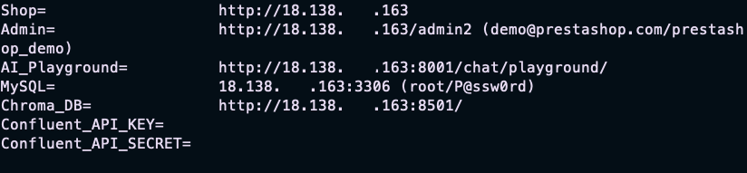
</div>

> #### AI playground will be look like this, you can play around with an AI. (you can leave **Conversation ID** and **User ID** as default values).
<div align="center" padding=25px>
    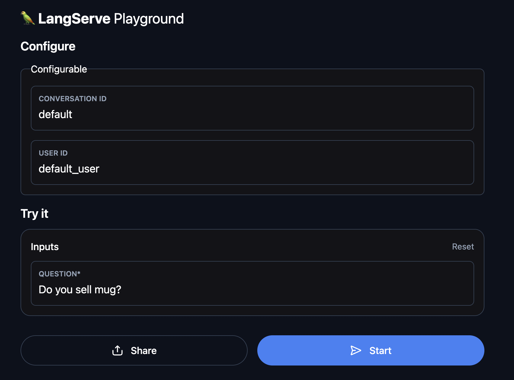
</div>

> #### You can access the Shop Web UI from the link above.
<div align="center" padding=25px>
    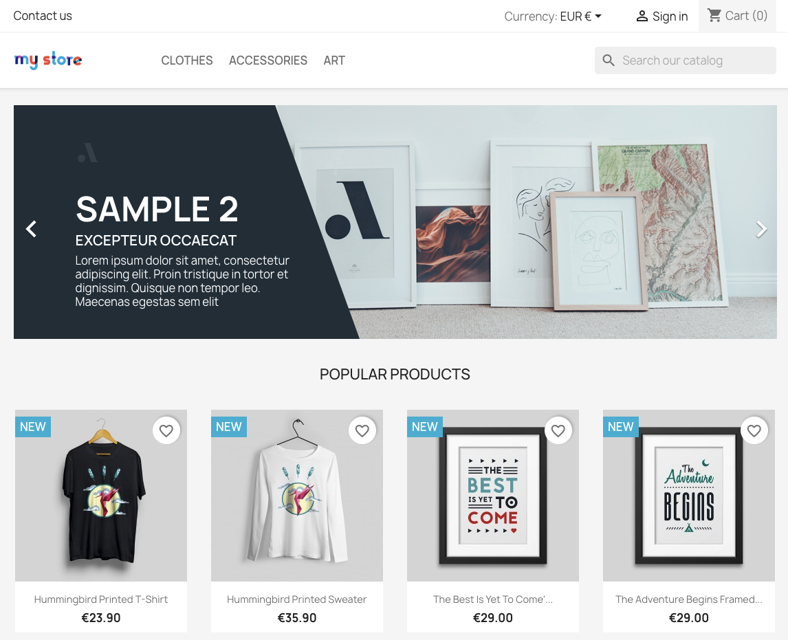
</div>

***

## <a name="step-2"></a>Step 2 Interacting with a bot that knows nothing.
1. Access AI playground (can find url from this [image](#file-url)) and play around AI without knowledge.
<div align="center" padding=25px>
    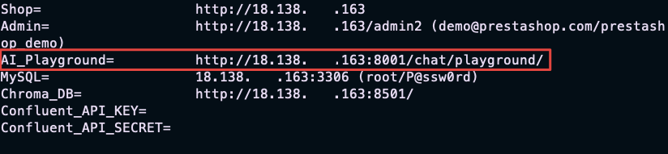
</div>
<div align="center" padding=25px>
    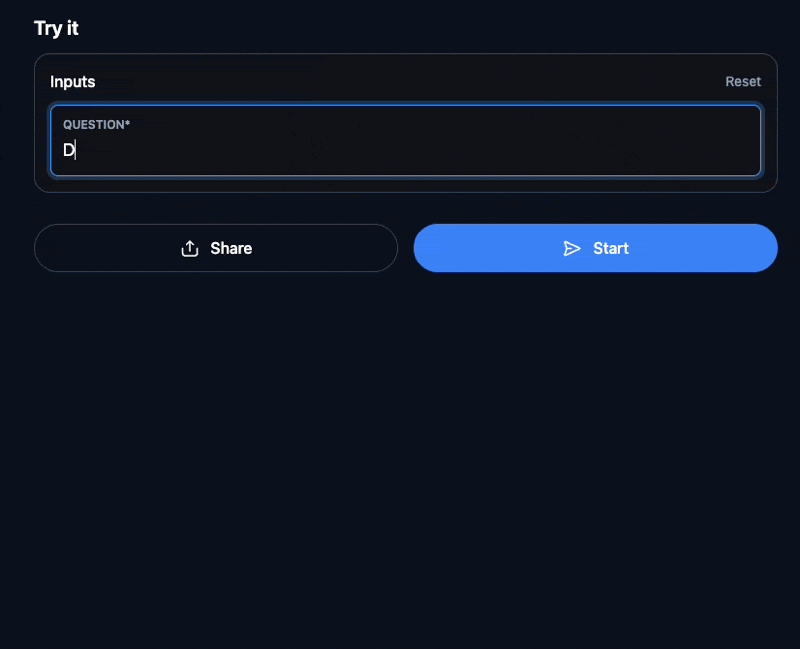
</div>

<br>

<div align="center" padding=25px>
    
</div>

>### 🔍 Why doesn’t the AI have any knowledge? If we look at the current architecture diagram, we can see that the AI is unable to provide any information because no data has been ingested into the vector store yet.

2. So, before we begin, it's important to understand what we'll be doing in this workshop. We'll ingest data from a shop into Confluent Kafka using a CDC Connector, process it with Confluent Flink, and then store it in a vector store using an indexer implemented as a Python application.
<div align="center" padding=25px>
    
</div>

***

## <a name="step-3"></a>Step 3 Log into and Explore Confluent cloud.
1. Log into Confluent Cloud and enter email and password.
> <a href="https://confluent.cloud" target="_blank">Confluent Cloud</a>
<div align="center" padding=25px>
    
</div>

>💡 See email and password from document.
2. Explore Confluent Cloud enviroment ***(Please refer environment name from your group number e.g. ecommerce_gp1)***.
<div align="center" padding=25px>
    
</div>

> Inside your environment will contain the Kafka cluster, you can click and explore the cluster.
<div align="center" padding=25px>
    
</div>

<br>

3. Explore Confluent Kafka Topic. 
>🔍 At this point, the Kafka topic will not yet exist. In the next step, we will set up a `connector` to ingest the data from database to Kafka topic.
<div align="center" padding=25px>
    
</div>

***

## <a name="step-4"></a>Step 4 Create connector to pull data from database.
1. Go to the `Connectors` tab on the left panel.
<div align="center" padding=25px>
    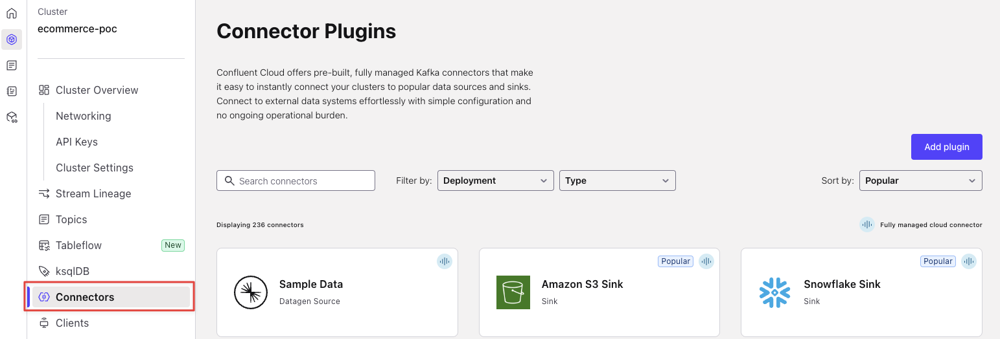
</div>

2. Search for `MySQL CDC Source V2`.
<div align="center" padding=25px>
    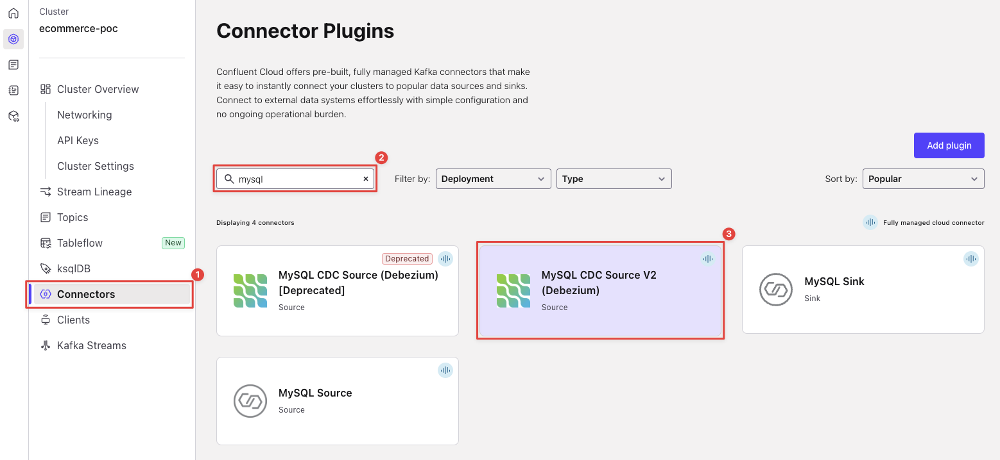
</div>

3. Select **"Use an existing API Key"** and enter your API Key and Secret.

>💡  If you haven’t used the terminal for a while, your session might time out. You can simply [SSH](#step-1) back in at any time.
<div align="center" padding=25px>
    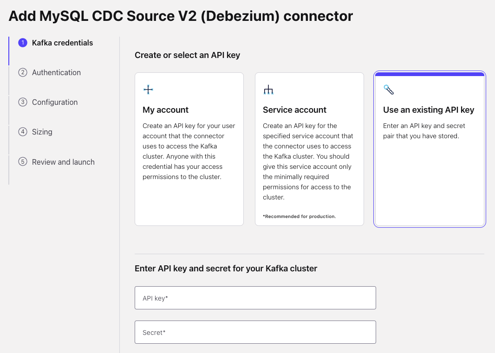
</div>

> You can copy from this [image](#file-url) in ***Confluent_API_KEY/Confluent_API_SECRET*** by select the key and CTRL+C
<div align="center" padding=25px>
    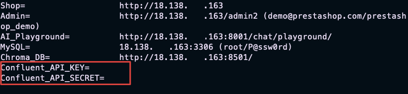
</div>
<br>

4. Fill in the `database` connection details.
<div align="center" padding=25px>
    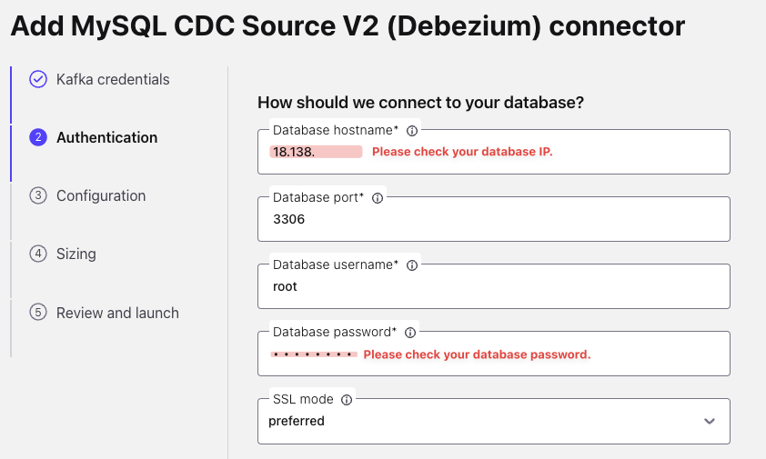
</div>
<div align="center" padding=25px>
    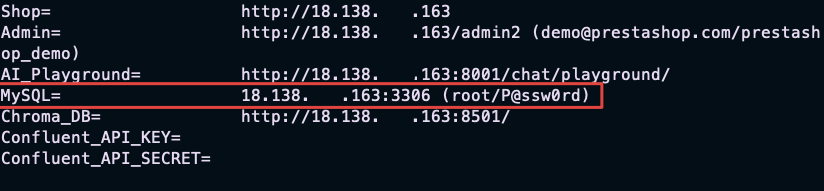
</div>

> Example: MySQL=13.250.99.10:3306 (root/P@ssw0rd)
**Database hostname** is 13.250.99.10 **Database port** is 3306 **Database username** is root and **Database password** is P@ssw0rd

5. Change the configuration settings.
<div align="center" padding=25px>
    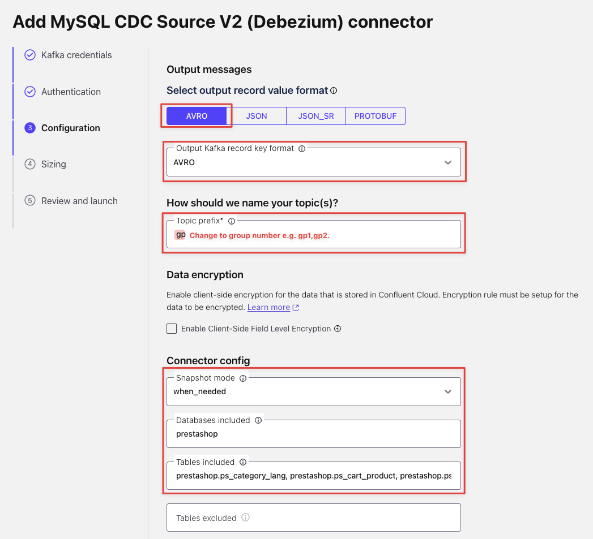
</div>

> ### Snapshot mode :
```text
when_needed
```
> ### Databases included :
```text
prestashop
```
> ### Tables included :
```text
prestashop.ps_category_lang, prestashop.ps_cart_product, prestashop.ps_product_shop, prestashop.ps_product_lang,prestashop.ps_category_product
```

6. On the `Sizing` page, click **`Continue`**.
7. On the `Review and Launch` page, click **`Continue`** again.
<div align="center" padding=25px>
    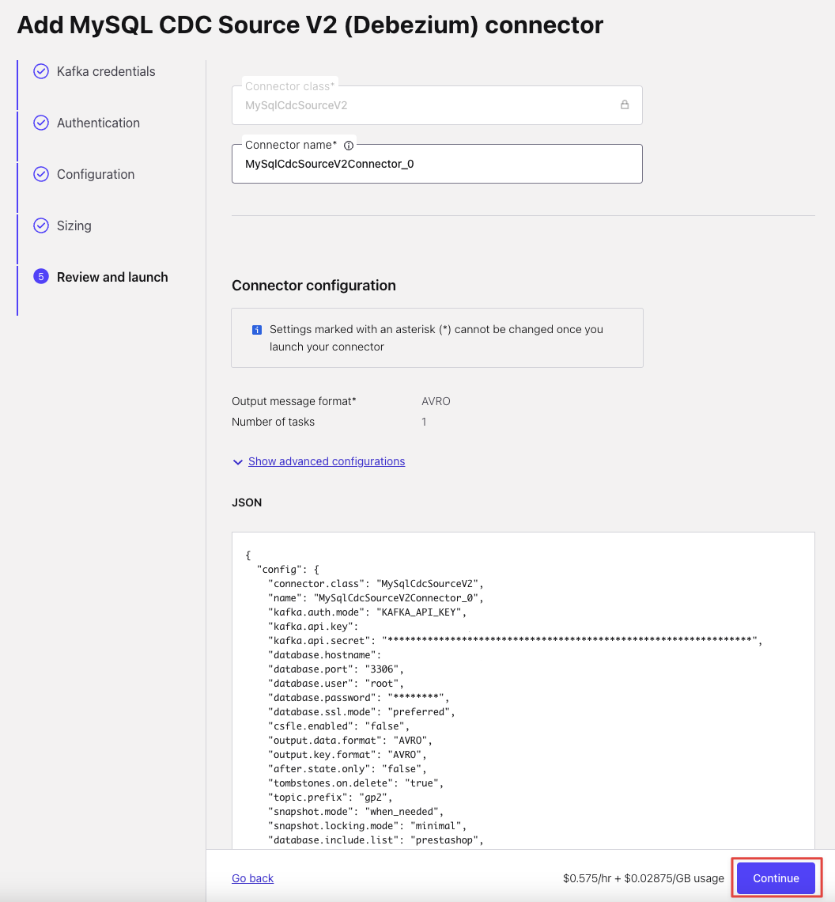
</div>

8. Wait until the connector status becomes **`"Running"`**.
<div align="center" padding=25px>
    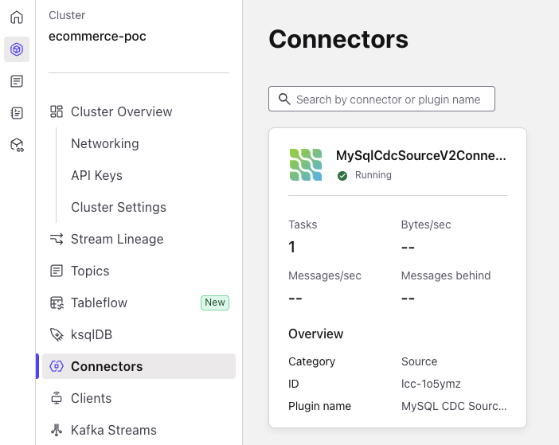
</div>

9. Go to the **`Topics`** tab — you should see a topic has been created by connector. 
> ### At this point, we’ve created a connector to pull data from the shop’s database into Confluent Kafka.
<div align="center" padding=25px>
    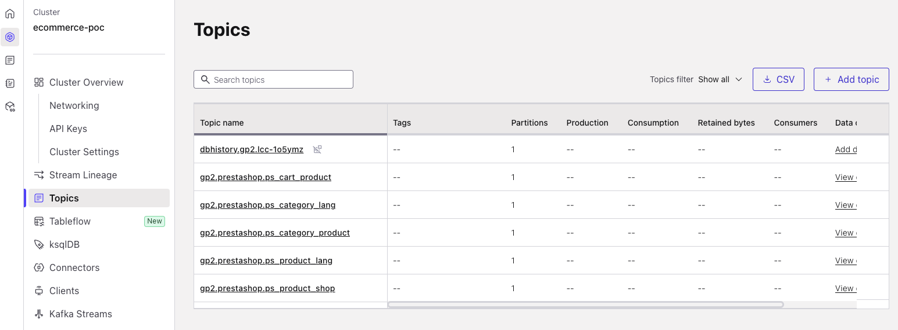
</div>

***

## <a name="step-5"></a>Step 5 Create Flink statement to process the data.

1. Click the `environment` name in the top-left corner of the screen.
<div align="center" padding=25px>
    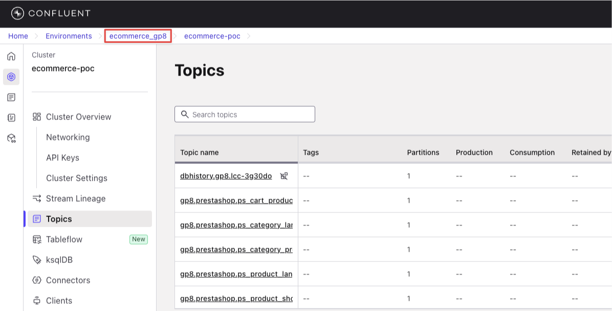
</div>

2. Go to the `Flink` page via your environment and select `Open SQL Workspace`.
<div align="center" padding=25px>
    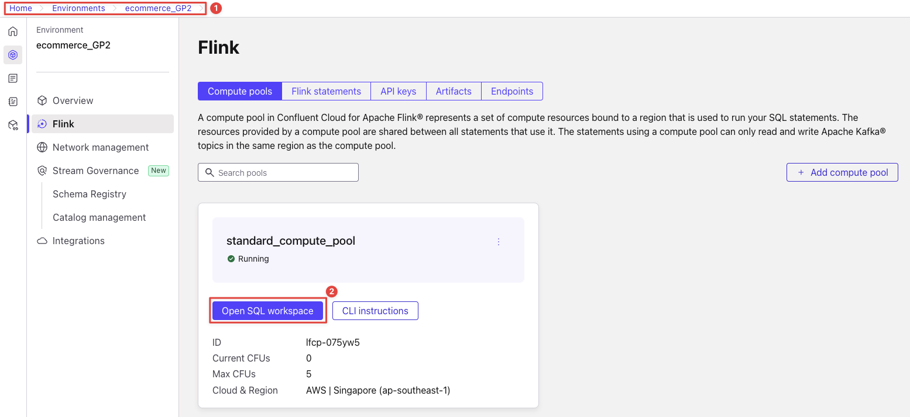
</div>

3. (`Important!`) In the top-right corner, set the Database to `ecommerce-poc` and make sure the Catalog matches your environment group.
<div align="center" padding=25px>
    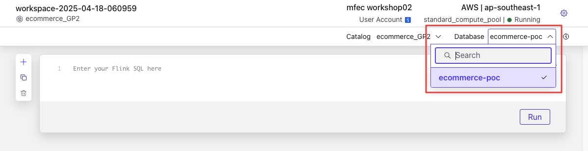
</div>

4. Place flink statement to the block for create the `products` table then click **`Run`**. 
```sql
CREATE TABLE products (
   `key` BIGINT NOT NULL,
   `available_for_order` BOOLEAN,
   `uri` string,
   `description` string,
   `description_short` string,
   `price` DECIMAL(20,6),
   CONSTRAINT `PRIMARY` PRIMARY KEY (`key`) NOT ENFORCED
);
```
<div align="center" padding=25px>
    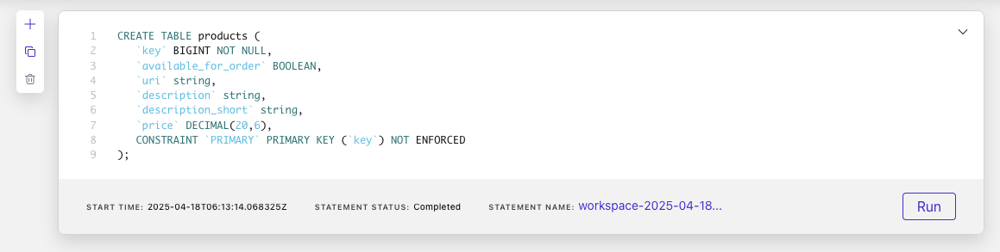
</div>
<br>

5. Click **`+`** on the left to open new code block, Place flink statement to join data from the connector and insert it into the `products` table.
> #### Replace all **`REPLACE_THIS`** (4 times) with your group ID, e.g., gp1, gp2. Use CTRL+F to help locate them.
```sql
insert into products
select
    p.id_product,
    p.available_for_order =1,
    concat(
        c.link_rewrite, '/' ,
        cast(p.id_product as string) , '-' ,
        cast (p.cache_default_attribute as string), '-' ,
        pl.link_rewrite , '.html' ),
    pl.description,
    pl.description_short,
    p.price
from `REPLACE_THIS.prestashop.ps_product_shop` p join `REPLACE_THIS.prestashop.ps_product_lang` pl on p.id_product = pl.id_product
left join `REPLACE_THIS.prestashop.ps_category_product` cp on pl.id_product=cp.id_product and p.id_category_default = cp.id_category
left join `REPLACE_THIS.prestashop.ps_category_lang` c on cp.id_category = c.id_category;
```
<div align="center" padding=25px>
    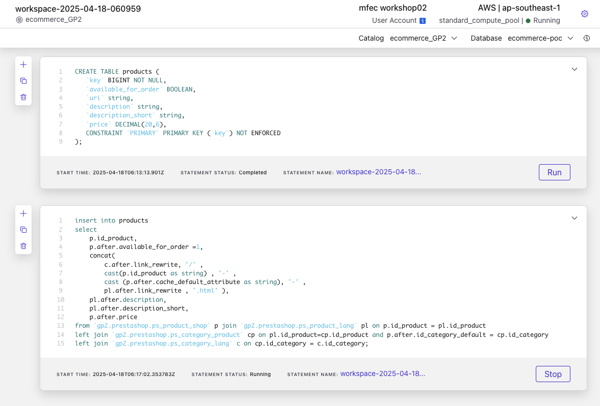
</div>
<br>

6. Click **`+`** on the left to open new code block, Run a SELECT query on the products table. This query will showing result from join statement.
```sql
SELECT * FROM `products`;
```
<div align="center" padding=25px>
    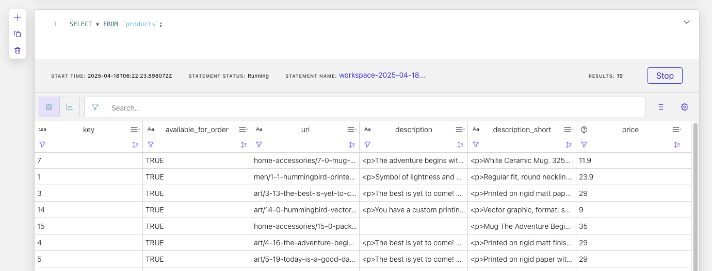
</div>

7. You can check the **`products`** topic in the `Topics` tab to see the written data.
> Click to `environment` tab on the left and select your environment then click `topic` tab
<div align="center" padding=25px>
    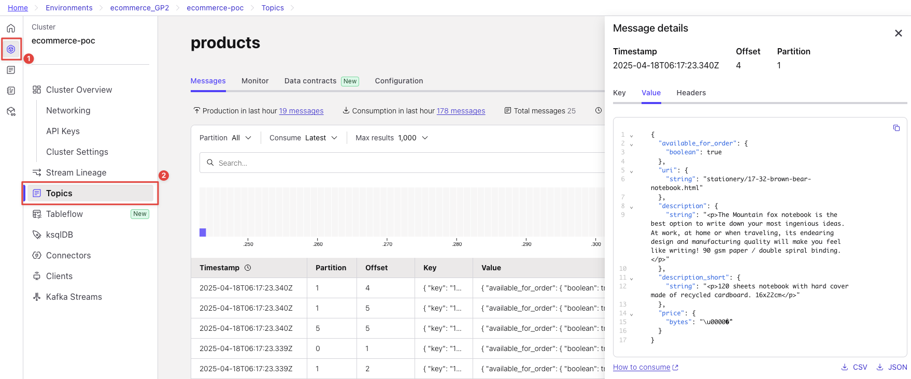
</div>

> ### 💡 Now we have the "products" topic populated — this will act as the real-time knowledge source for the AI.

***

## <a name="step-6"></a>Step 6 Create Indexer to update knowledge from Confluent to Vector store

1. Open new terminal (For MacOs using `terminal` and Window using `PowerShell`).
2. SSH to workshop environment on the new terminal.
> ### `password` will be invisible when input.
```ssh
ssh <user>@<url/ip>
```
<div align="center" padding=25px>
    
</div>

>💡 See document for user and url in each group, Example `ssh gp1@ec2.amazonaws.com`

3. Change current directory to `rag-ecommerce-master`.
```ssh
cd ~/rag-ecommerce-master
```

4. Run the command on new terminal to start the indexer application.
```bash
vm_pub_ip=$(cat ~/rag-ecommerce-master/terraform/tmp/commerce_bastion_ip.txt)
ssh_options="-o StrictHostKeyChecking=no -o UserKnownHostsFile=/dev/null"
```
```bash
ssh $ssh_options ec2-user@$vm_pub_ip docker run -d \
--name compose-indexer \
-v \$PWD:/work  \
--workdir /work \
-v /var/run/docker.sock:/var/run/docker.sock \
docker compose -f indexer.yml up -d
```

5. Check the data stored in the vector store(refer to [CHROMA_DB](#file-url)).
<div align="center" padding=25px>
    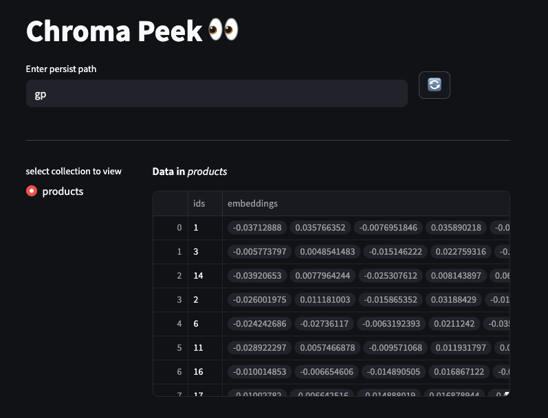
</div>

>If encountered any error, you can refresh the browser and **Enter persist path** wtih **gp** and click refresh on the right.

<div align="center" padding=25px>
    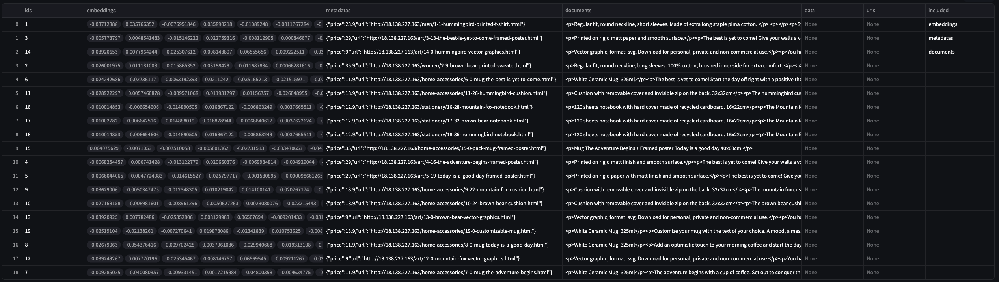
</div>

>### 💡 The embedded data is stored in ChromaDB, a vector store, and is used as a real-time knowledge source for the AI to answer questions based on actual data.

6. Try asking the AI again. [AI Playground](#file-url)
<div align="center" padding=25px>
    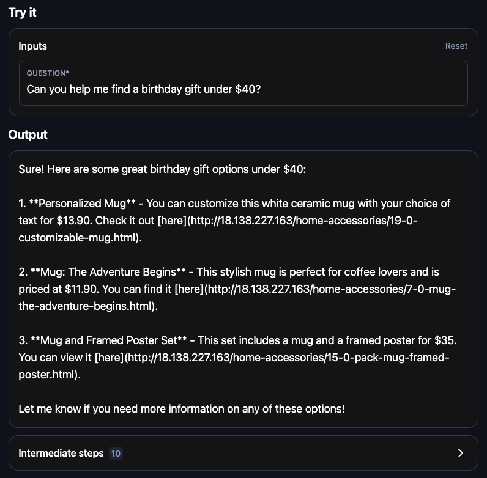
</div>

> ## 💡 As you can see, the AI is now able to respond to your questions since it has access to a knowledge base.

***