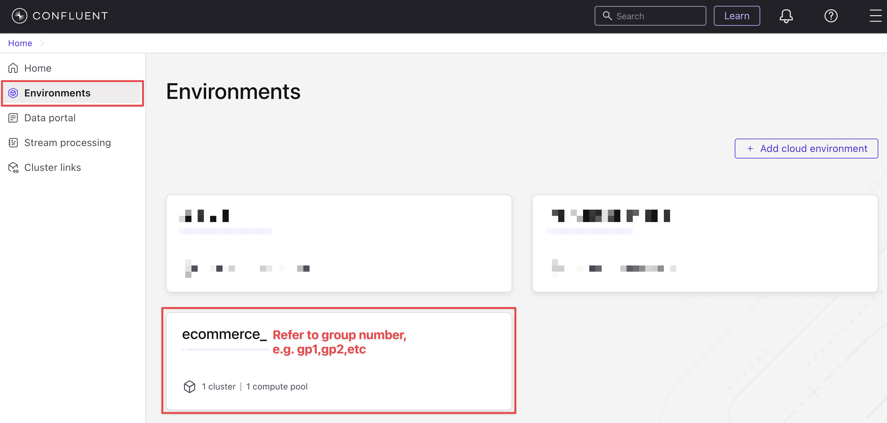
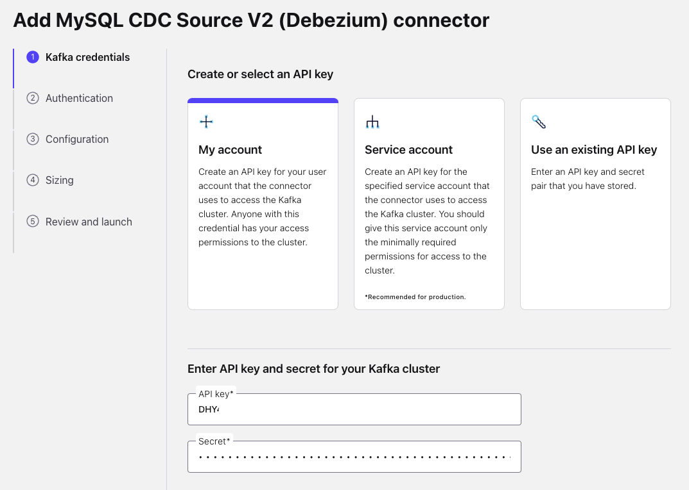
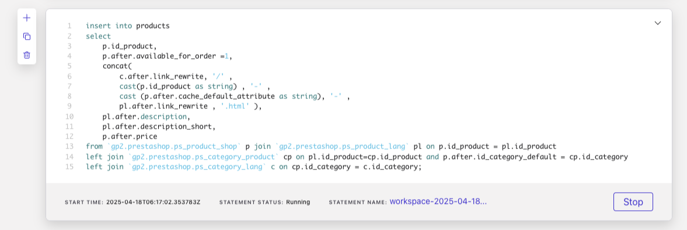
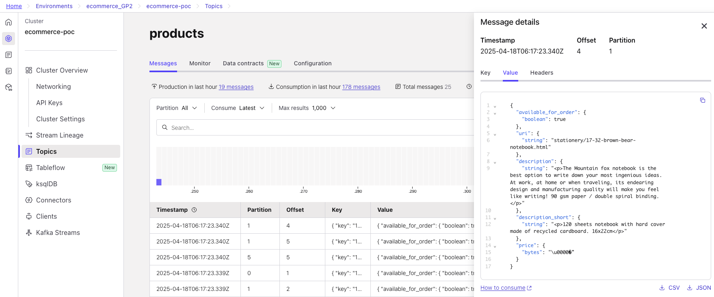

# <div align="center">Building Conversational AI with Real-Time Data Powered by Confluent</div>
## <div align="center">Lab Guide</div>
<br>

## **Agenda**
1. [Access environment](#step-1)
2. [Interacting with a bot that knows nothing](#step-2)
3. [Log into and Explore Confluent cloud](#step-3)
4. [Create connector to pull data from database](#step-4)
5. [Create Flink statement to process the data](#step-5)
6. [Create Indexer to update knowledge from Confluent to Vector store](#step-6)

***

## **Prerequisites**
### Make sure to review the workshop docs: GitHub repo, Confluent Cloud account, and credentials needed for the hands-on session.

***

## **Objective**
Welcome to “Build an AI-Powered Shopping Assistant with Retrieval-Augmented Generation (RAG) and Real-Time Data Streams”!
In this workshop, you’ll learn how to create a smart, conversational shopping experience that understands what customers are looking for—whether it’s “running shoes under $100” or “eco-friendly kitchen products made in the US.”

We’ll walk through how modern eCommerce platforms can combine real-time data, search, and AI to build a virtual assistant that’s always up-to-date and ready to help.

By the end of this workshop, you’ll understand how to:
- Turn product data into searchable knowledge using vector databases and embeddings
- Keep the assistant’s knowledge fresh with real-time updates from your systems
- Use large language models (LLMs) to make product discovery more natural and intuitive

Whether you're working on product search, virtual shopping assistants, or personalized recommendations, this workshop will give you a hands-on introduction to what’s possible with Retrieval-Augmented Generation in retail.


<div align="center">
  
</div>

>💡 This workshop is based on the open-source project:
> [bleporini/rag-ecommerce](https://github.com/bleporini/rag-ecommerce)
***

## <a name="step-1"></a>Step 1 Access environment.
1. Open terminal (For MacOs using `terminal` and Window using `PowerShell`).
2. SSH to workshop environment, password will be invisible when input.
```ssh
ssh <user>@<url/ip>
```
<div align="center" padding=25px>
    
</div>

>💡 See document for user and url in each group, Example `ssh gp1@ec2.amazonaws.com`

3. Change current directory to `rag-ecommerce-master`.
```ssh
cd ~/rag-ecommerce-master
```
<a name="file-url"></a>
4. Check your environment.
```ssh
cat ~/rag-ecommerce-master/etc/information.properties
```
<div align="center" padding=25px>
    
</div>

<div align="center" padding=25px>
    
</div>

> #### 💡 This file contain url of Ecommerce web, Admin web, AI playground, VectorStore UI and Cloud API key/sercret.

***

## <a name="step-2"></a>Step 2 Interacting with a bot that knows nothing.
1. Access AI playground (url in [1.4](#file-url)) and play around AI without knowledge.
<div align="center" padding=25px>
    
</div>

>#### 🔍 Why doesn’t the AI have any knowledge? If we look at the current architecture diagram, we can see that the AI is unable to provide any information because no data has been ingested into the vector store yet.

2. So, before we begin, it's important to understand what we'll be doing in this workshop. We'll ingest data from a shop into Confluent Kafka using a CDC Connector, process it with Confluent Flink, and then store it in a vector store using an indexer implemented as a Python application.
<div align="center" padding=25px>
    
</div>

***

## <a name="step-3"></a>Step 3 Log into and Explore Confluent cloud.
1. Log into [Confluent Cloud](https://confluent.cloud) and enter email and password.
<div align="center" padding=25px>
    
</div>

>💡 See email and password from document.
2. Explore Confluent Cloud enviroment (Please check your environment name from document).
<div align="center" padding=25px>
    
</div>
<br>

3. Explore Confluent Kafka Topic. 
>🔍 At the beginning, the Kafka topic will not yet exist. In the following section, we will set up a `connector` to pull the data in.
<div align="center" padding=25px>
    
</div>

***

## <a name="step-4"></a>Step 4 Create connector to pull data from database.
1. Go to the `Connectors` tab on the left panel.
<div align="center" padding=25px>
    
</div>

2. Search for `MySQL CDC Source V2`.
<div align="center" padding=25px>
    
</div>

3. Enter your API Key and Secret (refer to the this [file](#file-url)).
<div align="center" padding=25px>
    
</div>

4. Fill in the `database` connection details.
<div align="center" padding=25px>
    
</div>

> Database username/Database password : `root`/`P@ssw0rd`

5. Change the configuration settings.
<div align="center" padding=25px>
    
</div>

> Snapshot mode : `when_needed`
> Databases included : `prestashop`
> Tables included : `prestashop.ps_category_lang, prestashop.ps_cart_product, prestashop.ps_product_shop, prestashop.ps_product_lang,prestashop.ps_category_product`

6. On the Sizing page, click Continue.
7. On the Review and Launch page, click Continue again.
<div align="center" padding=25px>
    
</div>

8. Wait until the connector status becomes "Running".
<div align="center" padding=25px>
    
</div>

9. Go to the Topics tab — you should see a topic has been created.
<div align="center" padding=25px>
    
</div>

***

## <a name="step-5"></a>Step 5 Create Flink statement to process the data.

1. Go to the `Flink` page via your environment and select `Open SQL Workspace`.
<div align="center" padding=25px>
    
</div>

2. (`Important!`) In the top-right corner, set the Database to `ecommerce-poc` and make sure the Catalog matches your environment group.
<div align="center" padding=25px>
    
</div>

3. Place flink statement to the block for create the `products` table then click Run.
```sql
CREATE TABLE products (
   `key` BIGINT NOT NULL,
   `available_for_order` BOOLEAN,
   `uri` string,
   `description` string,
   `description_short` string,
   `price` DECIMAL(20,6),
   CONSTRAINT `PRIMARY` PRIMARY KEY (`key`) NOT ENFORCED
);
```
<div align="center" padding=25px>
    
</div>

4. Place flink statement to join data from the connector and insert it into the `products` table.
> #### Replace `REPLACE_THIS` (4 place) with your environment group e.g. gp1,gp2...
```sql
insert into products
select
    p.id_product,
    p.after.available_for_order =1,
    concat(
        c.after.link_rewrite, '/' ,
        cast(p.id_product as string) , '-' ,
        cast (p.after.cache_default_attribute as string), '-' ,
        pl.after.link_rewrite , '.html' ),
    pl.after.description,
    pl.after.description_short,
    p.after.price
from `REPLACE_THIS.prestashop.ps_product_shop` p join `REPLACE_THIS.prestashop.ps_product_lang` pl on p.id_product = pl.id_product
left join `REPLACE_THIS.prestashop.ps_category_product` cp on pl.id_product=cp.id_product and p.after.id_category_default = cp.id_category
left join `REPLACE_THIS.prestashop.ps_category_lang` c on cp.id_category = c.id_category;
```
<div align="center" padding=25px>
    
</div>

5. Run a SELECT query on the products table. This query will showing result from join statement.
```sql
SELECT * FROM `products`;
```
<div align="center" padding=25px>
    
</div>

6. You can check the products topic in the `Topics` tab to see the written data.
<div align="center" padding=25px>
    
</div>

> ### 💡 Now we have the "products" topic populated — this will act as the real-time knowledge source for the AI.

***

## <a name="step-6"></a>Step 6 Create Indexer to update knowledge from Confluent to Vector store